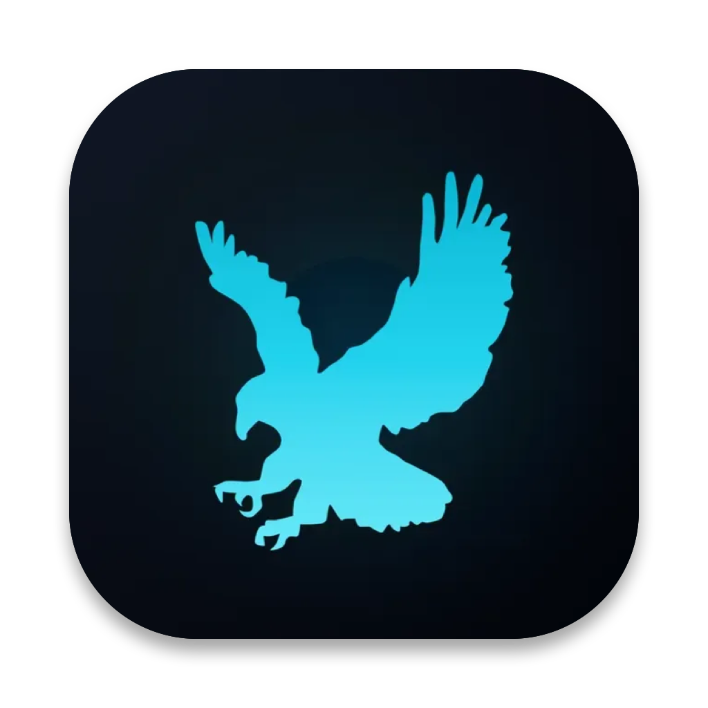

# Kawu Desktop 🍿

### Votre plateforme de streaming cinéma, séries et animés sur macOS.
**Fluide · Design Noir Glass · Multi-sources · Sans aucune publicité**

 

### [🍏 Télécharger Kawu v1.0.2 (DMG)](https://github.com/ztvplusfr/kawuapp/releases/download/v1.0.2/Kawu-1.0.2.dmg)

---

## 🚀 Téléchargement & Installation

1. **Téléchargez l'application** : Cliquez sur **[Kawu-1.0.2.dmg](https://github.com/ztvplusfr/kawuapp/releases/download/v1.0.2/Kawu-1.0.2.dmg)** *(5.7 Mo)*.
2. **Ouvrez le fichier `.dmg`** téléchargé et glissez l'icône **Kawu** dans le dossier **Applications**.
3. **Lancez Kawu** depuis votre Launchpad ou Spotlight.

> **💡 Au premier lancement (sécurité macOS standard) :**  
> Si macOS affiche le message *« Impossible d'ouvrir car le développeur ne peut pas être vérifié »* :  
> Faites un **Clic Droit** (ou *Ctrl + Clic*) sur **Kawu** dans votre dossier `/Applications` > Cliquez sur **Ouvrir**.  
> *(Cette manipulation n'est nécessaire qu'une seule fois).*

---

## ✨ Points forts & Fonctionnalités

* 🎬 **Films, Séries & Animés** : Catalogue constamment mis à jour avec les dernières sorties.
* 🇫🇷 **VF & VOSTFR** : Choix instantané de la langue et des sous-titres synchronisés.
* 💎 **Interface Noir Glass** : Un design moderne, épuré et immersif pour écrans Retina.
* 📱 **Télécommande Mobile** : Scannez le QR code dans l'application pour piloter la lecture depuis votre lit avec votre smartphone.
* 🔄 **Reprise de lecture & Historique** : Votre progression est automatiquement sauvegardée pour reprendre exactement là où vous vous étiez arrêté.
* 📺 **Navigation style TV** : Naviguez facilement avec les flèches du clavier ou la télécommande.
* ⚡ **Performance Native** : Application ultra-légère et fluide sans lenteur.

---

## ⌨️ Raccourcis Clavier

| Raccourci | Action |
| :--- | :--- |
| <kbd>Espace</kbd> ou <kbd>K</kbd> | Lecture / Pause |
| <kbd>→</kbd> / <kbd>←</kbd> | Avancer / Reculer de 10 secondes |
| <kbd>↑</kbd> / <kbd>↓</kbd> | Augmenter / Baisser le volume |
| <kbd>F</kbd> | Activer / Quitter le plein écran |
| <kbd>M</kbd> | Couper / Réactiver le son (Mute) |
| <kbd>C</kbd> | Activer / Désactiver les sous-titres |
| <kbd>Échap</kbd> | Quitter le lecteur / Retour en arrière |

---

## 💬 Rejoindre la communauté

Une question, un bug à signaler ou des titres à suggérer ?  
Rejoignez-nous sur le serveur Discord officiel :  
👉 **[discord.gg/GKH8APBxFN](https://discord.gg/GKH8APBxFN)**

---

  Fait avec ❤️ par l'équipe Kawu. © 2026 Kawu. Tous droits réservés.

